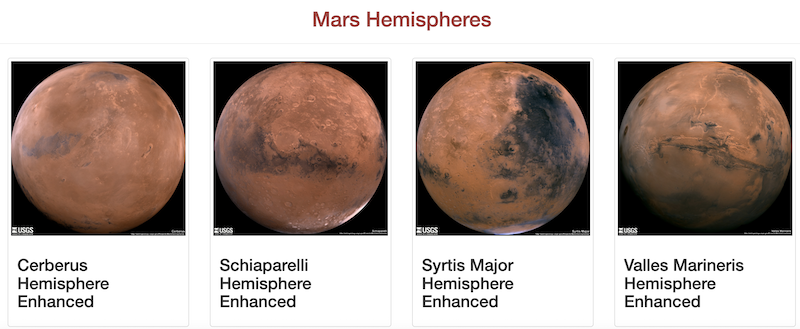
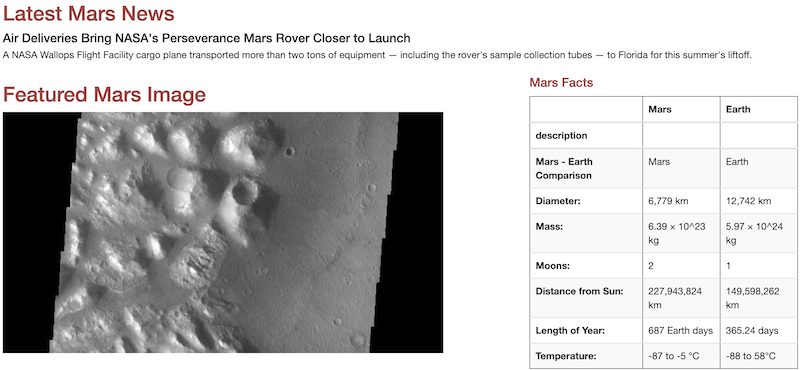

# Mission-to-Mars
SQLite｜SQLAlchemy｜Flask | Python
## Overview of the project
The purpose of the project is to create a web app by using BeautifulSoup and Splinter to scrape Mars data, and store the scraped data on a MongoDB database, then display the data by altering the design of the web app. 

## Results
1. Four full-resolution Mars hemisphere image URLs and titles were scraped from the Mars website.  

2. Results of adding the scraped hemisphere titles and images to our html webpage.  

3. After adding Bootstrap 3 components, the web app has been made mobile-responsive. Also, by styling the webpage, the "Scrape New Data" button has been changed to 'success' green color,

 and all the headings have been changed to red symbolizing Mars color. 
  

## Data Resources
* https://marshemispheres.com/
* https://redplanetscience.com/
* https://spaceimages-mars.com

