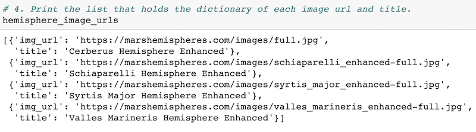

# Mission-to-Mars
SQLite｜SQLAlchemy｜Flask | Python
## Overview of the statistical analysis
The purpose of the project is to create a web app by using BeautifulSoup and Splinter to scrape Mars data, and store the scraped data on a MongoDB database, then display the data by altering the design of the web app. 

## Results
Four full-resolution Mars hemisphere image URLs and titles were scraped from the website https://marshemispheres.com:  

The web app was updated with Mars's hemisphere images and titles by adding Bootstrap 3 components. 

 

## Summary

